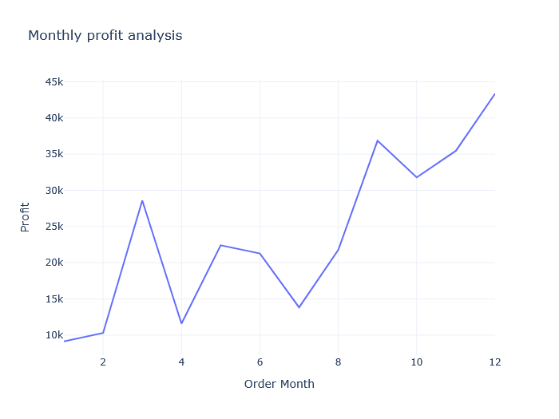
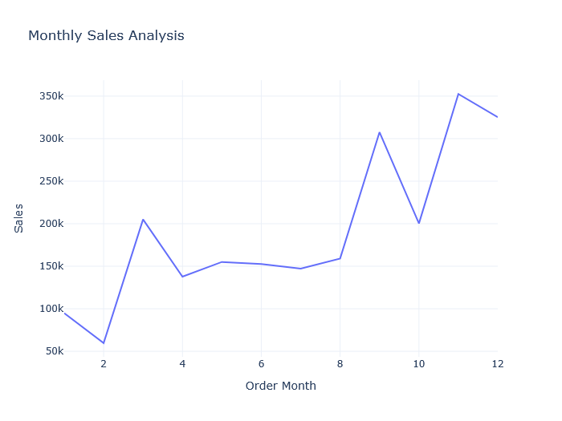
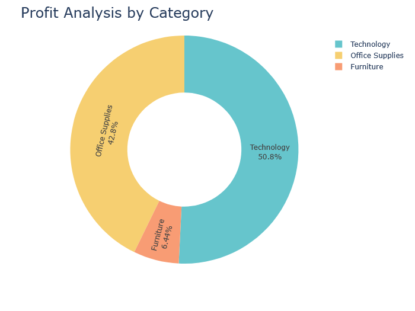
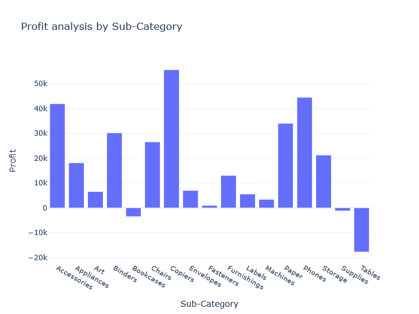
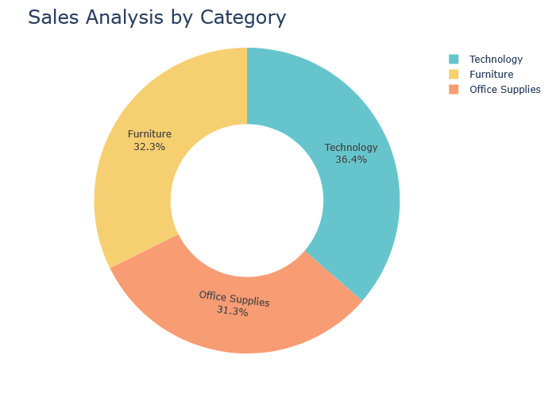
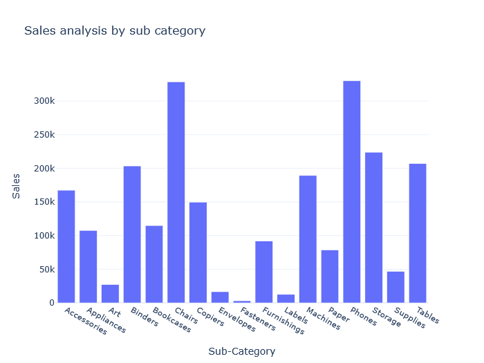
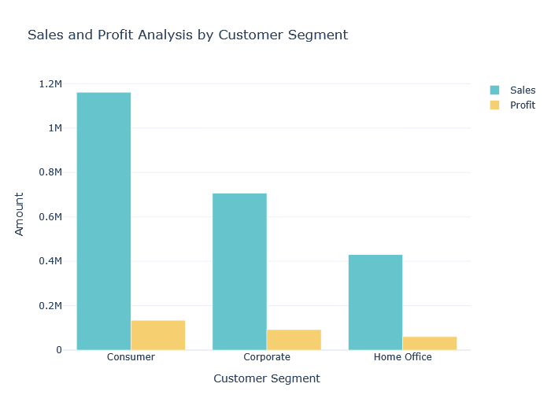

# 🛒 E-commerce Data Analysis 

This project presents an interactive data analysis of an e-commerce dataset using Python, Jupyter Notebook, and visualization libraries. It explores customer behavior, sales trends, and product performance to derive actionable business insights for stakeholders.

---

## 🎯 Project Objective

- 📈 Analyze monthly sales and profit trends of the e-commerce company.  
- 🛍 Identify top-performing product categories and sub-categories.  
- 👥 Explore customer segmentation to understand purchasing behavior.  
- 📊 Create visualizations to simplify insights for stakeholders and drive better decision-making.  

---

## 📂 Dataset

The dataset includes order-level data with the following attributes:  

- 🆔 **Order ID**  
- 🗓 **Order Date**  
- 🛒 **Product Category & Sub-category**  
- 💰 **Sales Amount & Profit**  
- 👥 **Customer Segment**  
- 🌐 **Customer Location**  

📥 Source: (https://www.kaggle.com/datasets/vivek468/superstore-dataset-final)

---

## 📊 Sample Visualizations

### 📅 1. Monthly Profit Analysis

---

### 📅 2. Monthly Sales Analysis

---

### 🏆 3. Profit Analysis by Category

---

### 🏆 4. Profit Analysis by Sub-category

---

### 💵 5. Sales Analysis by Category

---

### 💵 6. Sales Analysis by Sub-category

---

### 👥 7. Sales and Profit Analysis by Customer Segment

---

## 🛠 Tools & Technologies

- **Python**: Data Cleaning & Analysis (Pandas, NumPy)  
- **Jupyter Notebook**: Exploratory Data Analysis (EDA)  
- **Matplotlib, Seaborn, Plotly**: Data Visualization  
- **Git & GitHub**: Version Control  

---

## 🔑 Key Insights

- 📅 **December** shows the highest sales and profit due to holiday season trends.  
- 🏆 **Technology and Office Supplies** dominate in profit generation.  
- 🛍 Sub-categories like **Phones and Chairs** are key drivers of revenue.  
- 👥 **Corporate and Consumer** segments contribute the most to overall sales and profit.  

---

## 📧 About Me

👩‍💻 **Ajmeri Khatun**  
🎯 *Aspiring Data Analyst | Passionate about transforming raw data into actionable insights*  
📩 [ajmerikhatun.work@gmail.com]  
🌐 [LinkedIn Profile](https://linkedin.com/in/ajmeri-khatun)  
📂 [GitHub Portfolio](https://github.com/ajmerikhatun)  

---
